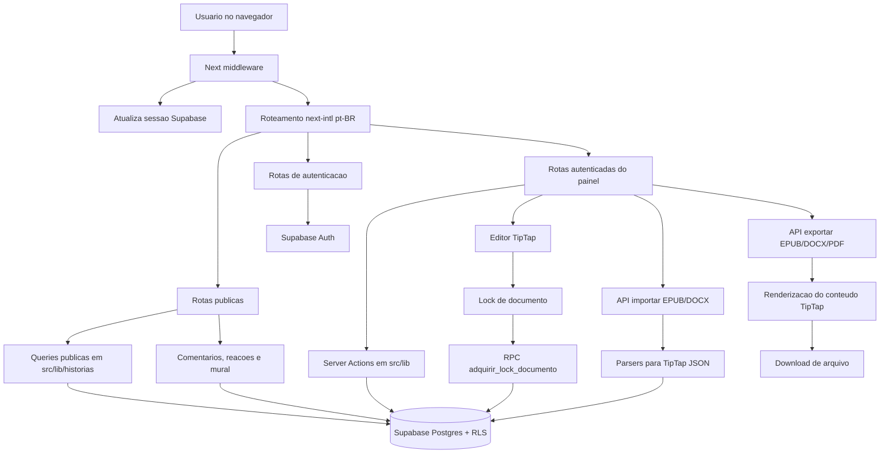
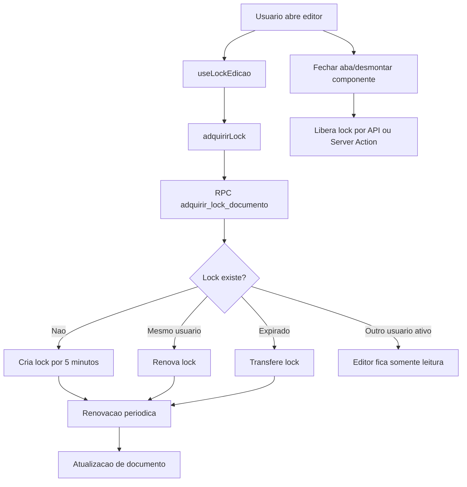
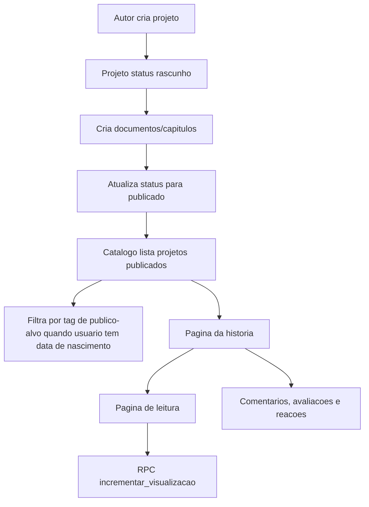
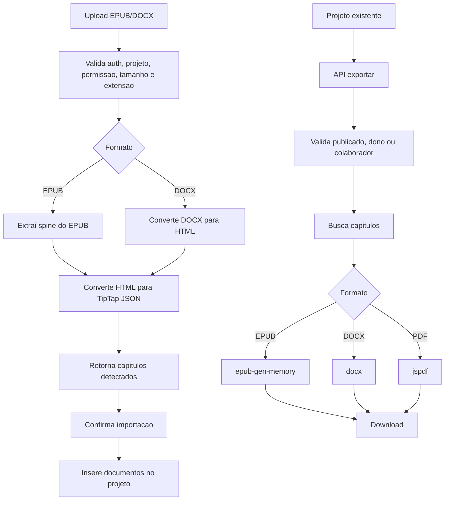

# Estado atual do projeto Bookja

Documento vivo do estado técnico e funcional do projeto. Deve ser atualizado em todo PR, branch ou alteração relevante que mude rotas, banco, integrações, fluxos, padrões, dependências, pendências ou decisões de arquitetura.

Última atualização: 2026-06-27

## Regra obrigatória de manutenção

- Toda mudança em funcionalidade, rota, Server Action, migration, integração, configuração ou fluxo de usuário deve atualizar este documento no mesmo conjunto de alterações.
- Ao concluir uma pendência listada aqui, mova o item para "Concluído recentemente" ou remova-o quando a mudança estiver consolidada.
- Ao criar nova pendência técnica ou funcional, registre impacto, local afetado e próximo passo.
- Ao adicionar ou alterar tabela, RPC, policy RLS ou bucket do Supabase, atualize as seções "Banco de dados", "Conexões" e "Pendências".
- Ao adicionar ou remover página, rota de API ou módulo em `src/lib`, atualize o fluxograma e o inventário.

## Visão geral

Bookja é uma plataforma web para leitura, escrita e publicação de histórias. O projeto atual usa Next.js App Router, React, TypeScript, Supabase Auth/Database/Storage, Server Actions, rotas API, TipTap para edição de conteúdo e bibliotecas de importação/exportação para EPUB, DOCX e PDF.

Plano de evolução e correções priorizadas: [PLANO_IMPLEMENTACAO.md](PLANO_IMPLEMENTACAO.md).

### Stack principal

- Runtime: Node.js 20.x.
- Frontend: Next.js 15, React 19, TypeScript, Tailwind CSS 4.
- Internacionalização: `next-intl`, atualmente apenas `pt-BR`, com prefixo obrigatório de locale.
- Banco e autenticação: Supabase via `@supabase/ssr` `^0.12.0` e `@supabase/supabase-js`.
- Editor: TipTap com Starter Kit, underline, placeholder e contagem de caracteres.
- Importação: EPUB via `jszip`, DOCX via `mammoth`.
- Exportação: EPUB via `epub-gen-memory`, DOCX via `docx`, PDF via `jspdf`.
- Testes: Vitest, Testing Library, jsdom e specs E2E Playwright com `playwright.config.ts`.
- Deploy/configuração: `vercel.json`, headers de segurança em `next.config.ts`.

## Fluxograma macro



## Estrutura do projeto

```text
.
├── e2e/                         # Specs Playwright
├── public/                      # Assets estaticos padrao
├── src/
│   ├── app/                     # Next.js App Router
│   │   ├── [locale]/            # Rotas localizadas
│   │   │   ├── (auth)/          # Login e cadastro
│   │   │   ├── (painel)/        # Area autenticada
│   │   │   └── (publico)/       # Home, catalogo, historia, perfil
│   │   └── api/                 # Rotas API para auth, locks, importar/exportar
│   ├── components/              # Componentes por dominio ou layout
│   ├── hooks/                   # Hooks client-side
│   ├── i18n/                    # Configuracao next-intl
│   ├── lib/                     # Acesso a dados, Server Actions e utilitarios
│   ├── messages/                # Mensagens pt-BR
│   ├── tests/                   # Testes unitarios/componentes
│   └── types/                   # Tipos compartilhados
└── supabase/migrations/          # Modelo, RLS, RPCs e seeds
```

## Rotas e fluxos desenvolvidos

### Público

- `/{locale}`: página inicial com busca e seções de histórias.
- `/{locale}/historias`: catálogo público com filtros por busca, tags e paginação.
- `/{locale}/historia/{id}`: detalhe de história publicada, capítulos públicos, coautores, tags, comentários e apoio via PIX.
- `/{locale}/historia/{id}/ler/{docId}`: leitura de capítulo/documento público.
- `/{locale}/perfil/{nomeUsuario}`: perfil público com histórias publicadas, leitura atual, mural e PIX.

### Autenticação

- `/{locale}/entrar`: login com Supabase.
- `/{locale}/cadastro`: cadastro com Supabase e metadados de perfil.
- `/api/auth/callback`: troca `code` por sessão e redireciona para biblioteca.
- Server Action `sair(locale)` para logout.

### Painel autenticado

- `/{locale}/biblioteca`: biblioteca do usuário.
- `/{locale}/favoritos`: favoritos do usuário.
- `/{locale}/notificacoes`: notificações e ações de leitura.
- `/{locale}/configuracoes`: edição básica de perfil.
- `/{locale}/projeto/novo`: criação de projeto.
- `/{locale}/projeto/{id}/editar`: edição de metadados, status, capa e tags.
- `/{locale}/projeto/{id}/documentos`: listagem, criação e reordenação de documentos.
- `/{locale}/projeto/{id}/doc/{docId}`: redirecionamento para área de escrita.
- `/{locale}/projeto/{id}/escrita`: editor TipTap com sumário, baú de informações e lock.
- `/{locale}/projeto/{id}/colaboradores`: convites, listagem e remoção de colaboradores.
- `/{locale}/projeto/{id}/importar`: importação de EPUB/DOCX.
- `/{locale}/projeto/{id}/previa`: prévia/impressão.

### APIs internas

- `POST /api/importar`: valida usuário, projeto, arquivo e extrai capítulos de EPUB/DOCX sem persistir.
- `POST /api/importar/confirmar`: persiste capítulos importados como documentos.
- `GET /api/exportar/{formato}?projetoId=...`: exporta projeto em `epub`, `docx` ou `pdf`.
- `POST /api/lock/heartbeat`: renova lock de edição.
- `POST /api/lock/liberar`: libera lock do documento.

As rotas de importação, exportação e lock usam o helper `src/lib/api/respostas.ts` para validação básica de UUID/payload JSON e respostas públicas padronizadas de erro.

## Fluxos de negócio

### Escrita colaborativa com lock



Implementado em:

- `src/hooks/useLockEdicao.ts`
- `src/lib/lock/actions.ts`
- `src/app/api/lock/heartbeat/route.ts`
- `src/app/api/lock/liberar/route.ts`
- `supabase/migrations/003_lock_rpc.sql`

### Publicação, catálogo e leitura



Implementado em:

- `src/lib/projetos/actions.ts`
- `src/lib/documentos/actions.ts`
- `src/lib/historias/queries.ts`
- `src/lib/comentarios/actions.ts`
- `supabase/migrations/007_incrementar_visualizacoes_rpc.sql`
- `supabase/migrations/009_data_nascimento.sql`

### Importação e exportação



Implementado em:

- `src/app/api/importar/route.ts`
- `src/app/api/importar/confirmar/route.ts`
- `src/app/api/exportar/[formato]/route.ts`
- `src/lib/importacao/*`
- `src/lib/exportacao/*`
- `src/lib/historias/renderizar.ts`

## Banco de dados

### Modelo atual

Migrations em `supabase/migrations` definem:

- `perfil`: perfil público vinculado a `auth.users`, com `data_nascimento` adicionada depois.
- `projeto`: obra literária, dono, status, capa, métricas e avaliação.
- `projeto_colaborador`: vínculo de coautores/revisores.
- `documento`: capítulos e documentos auxiliares em JSON TipTap.
- `documento_lock`: trava de edição.
- `tag` e `projeto_tag`: categorização, gênero, tema, aviso, fandom e público-alvo.
- `comentario` e `comentario_reacao`: comentários, respostas, avaliações e reações.
- `projeto_visualizacao`: analytics de visualizações.
- `plataforma_config`: chave/valor global.
- `favorito`: favoritos por usuário.
- `leitura_atual`: progresso de leitura.
- `notificacao`: notificações para usuário.
- `bloqueio`: bloqueio entre usuários.
- `mural_comentario` e `mural_reacao`: mural em perfis.

### Segurança e RLS

- RLS está habilitado para as tabelas principais.
- `002_rls_policies.sql` cria policies iniciais.
- `004_fix_rls_recursion.sql` corrige recursão entre `projeto` e `projeto_colaborador` usando funções `security definer`.
- `003_lock_rpc.sql` adiciona lock atômico com advisory lock.
- `007_incrementar_visualizacoes_rpc.sql` adiciona RPC para visualizações.
- `010_colaborador_aceite_obrigatorio.sql` exige `aceito_em` para acesso efetivo de colaborador, adiciona policy de aceite e trigger para limitar o update do convite.

### Storage

- Existe migration `008_storage_capas (NAO RODAR).sql` para policies de bucket `capas`, com comentário indicando criação manual no dashboard do Supabase.
- O estado real do bucket não é garantido pelo repositório. Precisa ser confirmado no ambiente Supabase.

## Conexões e configuração

### Supabase

Clientes:

- Browser: `src/lib/supabase/client.ts`, usa `NEXT_PUBLIC_SUPABASE_URL` e `NEXT_PUBLIC_SUPABASE_ANON_KEY`.
- Server: `src/lib/supabase/server.ts`, usa cookies de `next/headers`.
- Middleware: `src/lib/supabase/middleware.ts`, atualiza sessão via cookies antes do roteamento de locale.
- Middleware importa o entrypoint específico de `createServerClient` para evitar incluir o browser client no bundle Edge.
- Todos os clients Supabase estão tipados com `Database` de `src/types/database.ts`.
- `src/types/database.ts` contém tipos manuais provisórios alinhados às migrations, incluindo relacionamentos necessários para embeds PostgREST e retorno da RPC `adquirir_lock_documento`.

Variáveis esperadas:

- `NEXT_PUBLIC_SUPABASE_URL`
- `NEXT_PUBLIC_SUPABASE_ANON_KEY`

### Internacionalização

- Configuração em `src/i18n/config.ts`.
- Locale único: `pt-BR`.
- `localePrefix = "always"`, portanto rotas públicas e autenticadas usam prefixo `/pt-BR`.
- Mensagens em `src/messages/pt-BR.json`.

### Segurança HTTP

Headers configurados em `next.config.ts`:

- `X-Frame-Options: DENY`
- `X-Content-Type-Options: nosniff`
- `Referrer-Policy: strict-origin-when-cross-origin`
- `Permissions-Policy` bloqueando câmera, microfone e geolocalização.
- `Strict-Transport-Security`
- `X-DNS-Prefetch-Control`
- `images.remotePatterns` permite imagens hospedadas em `*.supabase.co`.

## Padrões de projeto observados

- App Router com agrupamento por contexto: `(publico)`, `(auth)`, `(painel)`.
- Server Components para páginas que buscam dados diretamente.
- Client Components para formulários, botões interativos, editor, menus e ações de UI.
- Server Actions em `src/lib/*/actions.ts` para mutações e operações autenticadas.
- Rotas API em `src/app/api` para fluxos que precisam lidar com upload, download, callback OAuth ou `sendBeacon`.
- Respostas de APIs internas centralizadas em `src/lib/api/respostas.ts` para evitar duplicação de validação básica e exposição de detalhes internos.
- Validações puras compartilhadas em `src/lib/validacao/comum.ts`, usadas por APIs e Server Actions.
- Server Actions de projetos, documentos, colaboradores e comentários usam `src/lib/actions/erros.ts` para respostas públicas e deixam de repassar mensagens técnicas do Supabase.
- Camada de dados acoplada ao Supabase, com RLS como barreira principal de autorização.
- Conteúdo de documentos armazenado como JSON compatível com TipTap.
- Mensagens de UI centralizadas em `src/messages/pt-BR.json`, mas ainda existem strings hardcoded em componentes/páginas.
- Testes unitários mockam Supabase, navegação e i18n.

## Testes existentes

### Unitários/componentes

Cobrem:

- Auth: login e cadastro.
- i18n: mensagens e configuração.
- Componentes: seletor de idioma e menu mobile.
- Hooks: lock de edição.
- Lib/actions: cliente Supabase, projetos e locks.

Configuração:

- `vitest.config.ts`
- `src/tests/setup.ts`

Comando:

```bash
npm run test
```

### E2E

Arquivos:

- `e2e/auth.spec.ts`
- `e2e/navegacao.spec.ts`

Configuração:

- `playwright.config.ts`

Status: validado localmente em 2026-06-26 com Chromium do Playwright instalado. `playwright-report/` e `test-results/` são artefatos locais ignorados pelo Git.

## Pendências e riscos atuais

### Alta prioridade

- Corrigir codificação/mojibake em arquivos com texto em português, incluindo migrations, mensagens e strings de erro.

### Média prioridade

- Confirmar e documentar o estado real do bucket Supabase `capas`; a migration está marcada como manual e "NAO RODAR".
- Expandir validação de entrada com schemas compartilhados. As rotas de importação/exportação/lock e as Server Actions de projetos/documentos/colaboradores/comentários já usam helpers comuns para UUID, JSON e erros públicos, mas mural, perfil, favoritos e notificações ainda têm validações manuais.
- Padronizar autorização de projeto. A verificação de dono/colaborador aparece duplicada em documentos, importação, exportação e colaboradores.
- Internacionalizar strings hardcoded em páginas e componentes do painel/editor.
- Revisar uso de `any` e casts em queries Supabase enquanto os tipos oficiais não forem gerados.
- Substituir os tipos manuais de Supabase por tipos gerados pela Supabase CLI quando houver acesso ao projeto remoto.

### Concluído recentemente

- Corrigida a notificação de comentários para usar `projeto.dono_id`.
- Removidos logs de debug de `listarProjetos`.
- Criadas actions específicas de publicação/despublicação com atualização de `publicado_em`.
- Corrigida a query de "Continuar lendo" para usar o schema real de `leitura_atual`.
- Adicionado registro de progresso ao abrir uma página de leitura.
- Restaurada a configuração ativa do Playwright em `playwright.config.ts`.
- Criado helper compartilhado de acesso a projeto.
- Aplicada autorização compartilhada em documentos, colaboradores, importação e exportação.
- Exportação pública de histórias publicadas liberada para visitantes, limitada a capítulos públicos.
- Substituído o placeholder de tipos Supabase por tipos manuais alinhados às migrations.
- Atualizado `@supabase/ssr` para `^0.12.0`, compatível com `@supabase/supabase-js` atual.
- Tipados os clients Supabase e corrigidos contratos revelados pela build: campos nullable, `tag.id` numérico, `Json` em documentos/importação e `StatusProjeto`.
- Declarados relacionamentos Supabase usados por embeds em projetos, documentos, colaboradores, tags, comentários, mural, favoritos, leitura atual e locks.
- E2E validado localmente com `.env.local` ignorado pelo Git.
- Warnings de lint removidos: hooks estabilizados, imports/mocks limpos e imagens migradas para `next/image`.
- Artefatos locais do Playwright adicionados ao `.gitignore`.
- Classificação etária corrigida: conteúdo acima de Livre é ocultado quando a idade é desconhecida.
- Colaboradores pendentes não recebem acesso efetivo antes do aceite; `eh_colaborador` e o helper de acesso exigem `aceito_em`.
- Criado helper `src/lib/api/respostas.ts` e aplicado em importação, exportação e lock para padronizar validação de UUID/payload JSON e impedir exposição de detalhes internos em erros 500.
- Adicionados testes unitários para validações e mapeamento de erros de API.
- Criado helper `src/lib/validacao/comum.ts` para validações neutras e reutilização entre APIs e Server Actions.
- Criado helper `src/lib/actions/erros.ts` para erros públicos em Server Actions.
- Server Actions de projetos passaram a validar UUID, título e status no servidor e a retornar mensagens públicas para falhas de banco.
- Server Actions de documentos passaram a validar UUID, tipo, conteúdo JSON, contagem de palavras e ordem antes de mutações.
- Adicionados testes unitários para validação e erros públicos em projetos/documentos.
- Server Actions de colaboradores passaram a validar UUID, nome de usuário e papel antes de convidar/remover/listar/aceitar convite.
- Server Actions de comentários passaram a validar UUID, conteúdo, nota e emoji antes de comentar/responder/reagir/listar.
- Adicionados testes unitários para validação e erros públicos em colaboradores/comentários.

### Baixa prioridade

- Remover assets padrão não usados em `public/`, se não forem necessários.
- Avaliar se `plataforma_config` e `bloqueio` já têm fluxo de UI ou são apenas preparação de modelo.
- Avaliar testes para importação/exportação e catálogo, que são áreas com lógica significativa.

## Como continuar o desenvolvimento

1. Antes de alterar código, verificar se a mudança afeta alguma seção deste documento.
2. Para mudanças de banco, criar nova migration sequencial e atualizar "Banco de dados".
3. Para novas funcionalidades, adicionar rota/ação/componente no inventário e atualizar o fluxograma relevante.
4. Para bugs corrigidos, mover ou remover a pendência correspondente.
5. Rodar validação compatível com a mudança:

```bash
npm run lint
npm run test
npm run build
```

Para E2E, resolver antes a configuração Playwright:

```bash
npm run test:e2e
```
