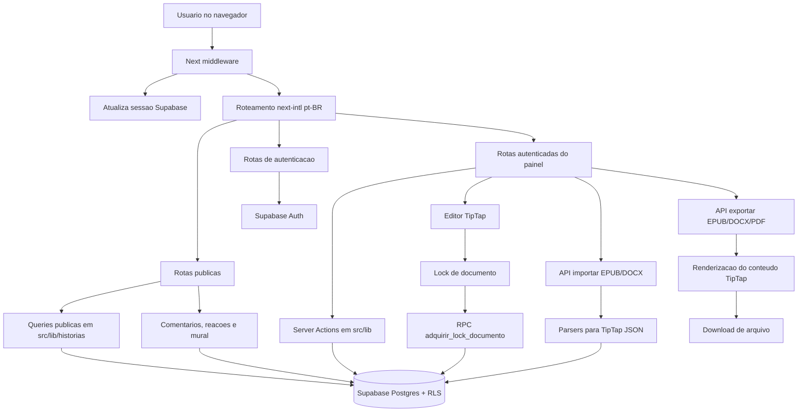
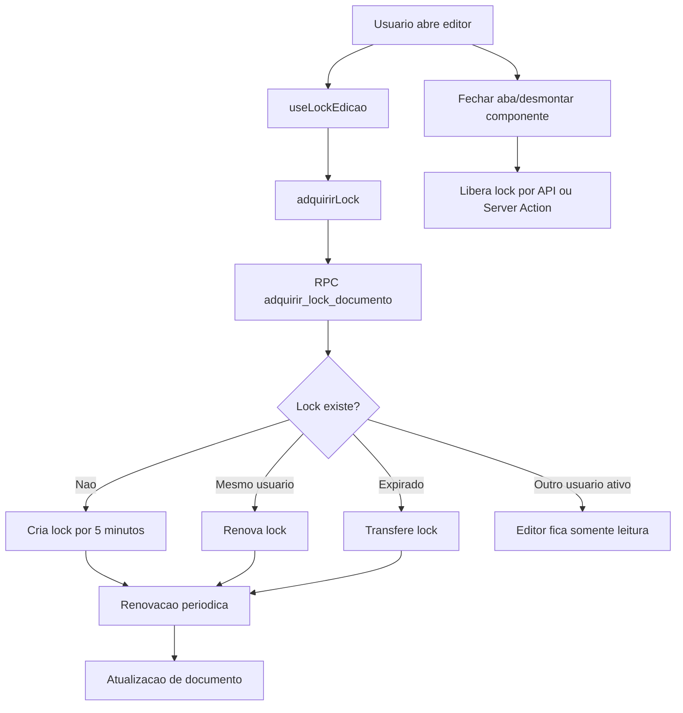
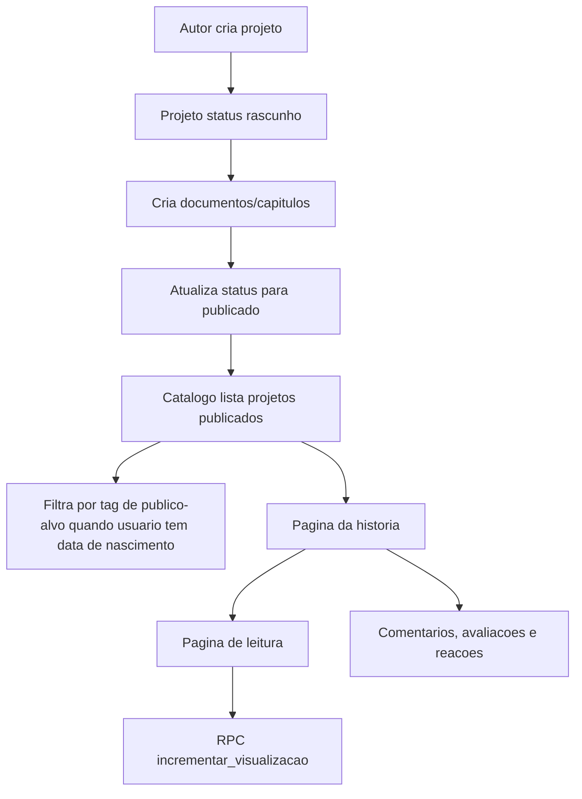
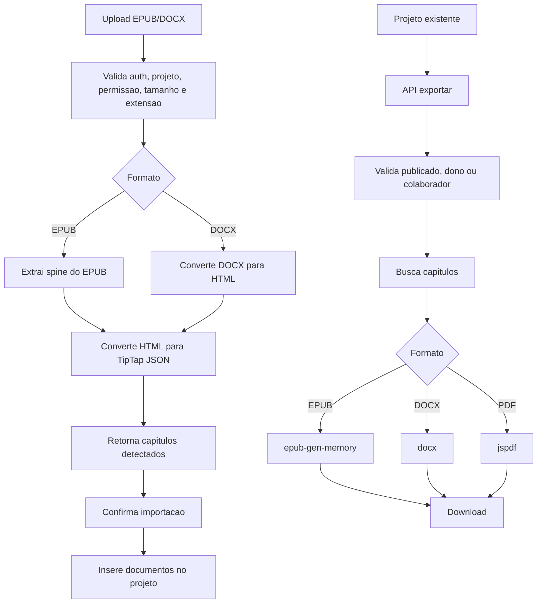

# Estado atual do projeto Bookja

Documento vivo do estado técnico e funcional do projeto. Deve ser atualizado em todo PR, branch ou alteração relevante que mude rotas, banco, integrações, fluxos, padrões, dependências, pendências ou decisões de arquitetura.

Última atualização: 2026-06-28 (plano de primeira entrega mobile-first)

## Regra obrigatória de manutenção

- Toda mudança em funcionalidade, rota, Server Action, migration, integração, configuração ou fluxo de usuário deve atualizar este documento no mesmo conjunto de alterações.
- Ao concluir uma pendência listada aqui, mova o item para "Concluído recentemente" ou remova-o quando a mudança estiver consolidada.
- Ao criar nova pendência técnica ou funcional, registre impacto, local afetado e próximo passo.
- Ao adicionar ou alterar tabela, RPC, policy RLS ou bucket do Supabase, atualize as seções "Banco de dados", "Conexões" e "Pendências".
- Ao adicionar ou remover página, rota de API ou módulo em `src/lib`, atualize o fluxograma e o inventário.

## Visão geral

Bookja é uma plataforma web para leitura, escrita e publicação de histórias. O projeto atual usa Next.js App Router, React, TypeScript, Supabase Auth/Database/Storage, Server Actions, rotas API, TipTap para edição de conteúdo e bibliotecas de importação/exportação para EPUB, DOCX e PDF.

Plano de evolução e correções priorizadas: [PLANO_IMPLEMENTACAO.md](PLANO_IMPLEMENTACAO.md).

### Stack principal

- Runtime: Node.js 20.x.
- Frontend: Next.js 15, React 19, TypeScript, Tailwind CSS 4.
- Internacionalização: `next-intl`, atualmente apenas `pt-BR`, com prefixo obrigatório de locale.
- Banco e autenticação: Supabase via `@supabase/ssr` `^0.12.0` e `@supabase/supabase-js`.
- Editor: TipTap com Starter Kit, underline, placeholder, contagem de caracteres, auto-save (debounce 2,5s + aviso de saída + flush antes de navegações internas principais), salvamento manual explícito, corretor ortográfico nativo do navegador em PT-BR e status editorial por capítulo (`rascunho`, `revisao`, `revisao_supervisionada`, `publicado`).
- Fichas/ambientação: editor estruturado por campos flexíveis (modelos editáveis: adicionar/remover/renomear campos, linha curta ou texto longo), salvo em `documento.conteudo` como JSON `{ v, campos }`, com compatibilidade para conteúdo legado em texto.
- Colaboração: presença ao vivo no editor de capítulo via Supabase Realtime (avatares de quem está no capítulo + indicador editando/vendo). Edição simultânea com merge (CRDT) ainda não implementada.
- Importação: EPUB via `jszip`, DOCX via `mammoth`.
- Exportação: EPUB via `epub-gen-memory`, DOCX via `docx`, PDF via `jspdf`.
- Testes: Vitest, Testing Library, jsdom e specs E2E Playwright com `playwright.config.ts`.
- Deploy/configuração: `vercel.json`, headers de segurança em `next.config.ts`.

## Fluxograma macro



## Estrutura do projeto

```text
.
├── e2e/                         # Specs Playwright
├── public/                      # Assets estaticos padrao
├── src/
│   ├── app/                     # Next.js App Router
│   │   ├── [locale]/            # Rotas localizadas
│   │   │   ├── (auth)/          # Login e cadastro
│   │   │   ├── (painel)/        # Area autenticada
│   │   │   └── (publico)/       # Home, catalogo, historia, perfil
│   │   └── api/                 # Rotas API para auth, locks, importar/exportar
│   ├── components/              # Componentes por dominio ou layout
│   ├── hooks/                   # Hooks client-side
│   ├── i18n/                    # Configuracao next-intl
│   ├── lib/                     # Acesso a dados, Server Actions e utilitarios
│   ├── messages/                # Mensagens pt-BR
│   ├── tests/                   # Testes unitarios/componentes
│   └── types/                   # Tipos compartilhados
└── supabase/migrations/          # Modelo, RLS, RPCs e seeds
```

## Rotas e fluxos desenvolvidos

### Público

- `/{locale}`: página inicial com busca e seções de histórias.
- `/{locale}/historias`: catálogo público com filtros por busca, tags e paginação.
- `/{locale}/historia/{id}`: detalhe de história publicada, capítulos públicos, coautores, tags, comentários e apoio via PIX.
- `/{locale}/historia/{id}/ler/{docId}`: leitura de capítulo publicado (`documento.status = publicado` e `publico = true`), com bastidores do autor (post-its), reações e comentários do capítulo.
- `/{locale}/perfil/{nomeUsuario}`: perfil público com histórias publicadas, leitura atual, mural e PIX.

### Autenticação

- `/{locale}/entrar`: login com Supabase.
- `/{locale}/cadastro`: cadastro com Supabase e metadados de perfil.
- `/api/auth/callback`: troca `code` por sessão e redireciona para biblioteca.
- Server Action `sair(locale)` para logout.

### Painel autenticado

- `/{locale}/biblioteca`: biblioteca do usuário.
- `/{locale}/favoritos`: favoritos do usuário.
- `/{locale}/notificacoes`: notificações e ações de leitura.
- `/{locale}/configuracoes`: edição de perfil (nome de exibição, bio, data de nascimento, chave PIX), apresentada como "Editar perfil" e acessada a partir da página de perfil, não como item de menu separado.
- `/{locale}/projeto/novo`: criação de projeto.
- `/{locale}/projeto/{id}/editar`: edição de metadados, status, capa e tags.
- `/{locale}/projeto/{id}/documentos`: listagem, criação e reordenação de documentos.
- `/{locale}/projeto/{id}/doc/{docId}`: redirecionamento para área de escrita.
- `/{locale}/projeto/{id}/escrita`: editor TipTap com sumário, lock e presença ao vivo. A visualização do baú de informações foi retirada desta tela; o motor de fichas/ambientação permanece no código para ser reposicionado em outro fluxo.
- `/{locale}/projeto/{id}/colaboradores`: convites, listagem e remoção de colaboradores.
- `/{locale}/projeto/{id}/importar`: importação de EPUB/DOCX.
- `/{locale}/projeto/{id}/previa`: prévia/impressão.

### APIs internas

- `POST /api/importar`: valida usuário, projeto, arquivo e extrai capítulos de EPUB/DOCX sem persistir.
- `POST /api/importar/confirmar`: persiste capítulos importados como documentos.
- `GET /api/exportar/{formato}?projetoId=...`: exporta projeto em `epub`, `docx` ou `pdf`.
- `POST /api/lock/heartbeat`: renova lock de edição.
- `POST /api/lock/liberar`: libera lock do documento.

As rotas de importação, exportação e lock usam o helper `src/lib/api/respostas.ts` para validação básica de UUID/payload JSON e respostas públicas padronizadas de erro.

## Fluxos de negócio

### Escrita colaborativa com lock



Implementado em:

- `src/hooks/useLockEdicao.ts`
- `src/lib/lock/actions.ts`
- `src/app/api/lock/heartbeat/route.ts`
- `src/app/api/lock/liberar/route.ts`
- `supabase/migrations/003_lock_rpc.sql`

### Publicação, catálogo e leitura



Implementado em:

- `src/lib/projetos/actions.ts`
- `src/lib/documentos/actions.ts`
- `src/lib/historias/queries.ts`
- `src/lib/comentarios/actions.ts`
- `supabase/migrations/007_incrementar_visualizacoes_rpc.sql`
- `supabase/migrations/009_data_nascimento.sql`

### Importação e exportação



Implementado em:

- `src/app/api/importar/route.ts`
- `src/app/api/importar/confirmar/route.ts`
- `src/app/api/exportar/[formato]/route.ts`
- `src/lib/importacao/*`
- `src/lib/exportacao/*`
- `src/lib/historias/renderizar.ts`

## Banco de dados

### Modelo atual

Migrations em `supabase/migrations` definem:

- `perfil`: perfil público vinculado a `auth.users`, com `data_nascimento` adicionada depois.
- `projeto`: obra literária, dono, status, capa, métricas e avaliação.
- `projeto_colaborador`: vínculo de coautores/revisores.
- `documento`: capítulos e documentos auxiliares em JSON TipTap.
- `documento_lock`: trava de edição.
- `tag` e `projeto_tag`: categorização, gênero, tema, aviso, fandom e público-alvo.
- `comentario` e `comentario_reacao`: comentários, respostas, avaliações e reações.
- `documento_nota`: notas/curiosidades do autor (post-its) por capítulo, visíveis na leitura.
- `documento_reacao`: reações (emoji) de leitores por capítulo.
- `projeto_visualizacao`: analytics de visualizações.
- `plataforma_config`: chave/valor global.
- `favorito`: favoritos por usuário.
- `leitura_atual`: progresso de leitura.
- `notificacao`: notificações para usuário.
- `bloqueio`: bloqueio entre usuários.
- `mural_comentario` e `mural_reacao`: mural em perfis.

### Segurança e RLS

- RLS está habilitado para as tabelas principais.
- `002_rls_policies.sql` cria policies iniciais.
- `004_fix_rls_recursion.sql` corrige recursão entre `projeto` e `projeto_colaborador` usando funções `security definer`.
- `003_lock_rpc.sql` adiciona lock atômico com advisory lock.
- `007_incrementar_visualizacoes_rpc.sql` adiciona RPC para visualizações.
- `010_colaborador_aceite_obrigatorio.sql` exige `aceito_em` para acesso efetivo de colaborador, adiciona policy de aceite e trigger para limitar o update do convite.
- `012_notas_reacoes_capitulo.sql` cria `documento_nota` e `documento_reacao`: escrita de nota restrita a dono/colaborador, reação restrita ao próprio usuário.
- `013_fix_rls_select_notas_reacoes.sql` corrige o `select` de notas/reações: deixa de ser público e passa a exigir capítulo público de projeto publicado, ou dono/colaborador — evitando vazamento de bastidores de rascunhos.
- `015_status_documento_notificacoes.sql` adiciona status editorial em `documento`, sincroniza publicação por capítulo e cria RPCs seguras para notificações internas sem policy ampla de insert.
- `016_aprovacao_revisao_documento.sql` cria `documento_aprovacao` para revisão supervisionada por colaboradores, com RLS para dono/colaboradores e aprovação individual.
- `019_fix_rls_select_comentario.sql` endurece o SELECT público de `comentario` e `comentario_reacao`: antes usavam `qual = true`, expondo comentários (e reações) de projetos rascunho e de capítulos privados via PostgREST. Passam a permitir leitura pública só de comentário em projeto publicado (e, se for de capítulo específico, capítulo público e publicado), ou para dono/colaborador. `mural_comentario`/`mural_reacao` foram mantidos públicos de propósito (mural de perfil público, sem fronteira de publicação). Verificado por teste transacional (rollback): comentário em projeto publicado fica visível ao anônimo, em rascunho fica oculto.
- `018_favorito_nao_dono.sql` impede o dono de favoritar a própria história: a policy `favorito_insert_own` passa a exigir `usuario_id = auth.uid() AND NOT eh_dono_projeto(projeto_id, auth.uid())`. A migration também remove auto-favoritos já existentes. UI (botão escondido para o dono) e Server Action (`toggleFavorito` rejeita o dono) reforçam a regra.
- `017_fix_rls_select_documento_publico.sql` endurece o SELECT público de `documento`: antes exigia apenas `publico = true`, permitindo ler via PostgREST direto capítulos não publicados marcados `publico = true` ou capítulos de projetos despublicados. Passa a exigir `publico = true AND status = 'publicado'` e projeto pai com `status = 'publicado'`, alinhado à página de leitura e ao padrão da 013. Verificado: leitor anônimo passou a ver 4 de 16 documentos.

### Storage

- Bucket público `capas` provisionado no Supabase via `011_storage_capas.sql` (idempotente).
- Policies de storage escopadas ao dono do projeto: insert/update/delete exigem que o 1º segmento do path (`<projetoId>/...`) pertença a um `projeto` cujo `dono_id = auth.uid()`. O bucket é público (URLs servidas sem policy); a policy de listagem ampla foi removida em `014_capas_remove_listagem_publica.sql` para não expor a lista de arquivos.
- Upload de capa agora envia a imagem (JPEG redimensionado client-side) para o bucket e salva apenas a URL pública em `projeto.capa_url`; troca/remoção apaga o objeto antigo (best-effort).
- A migration `008_storage_capas (NAO RODAR).sql` foi marcada como obsoleta, mantida só por histórico (era manual e permissiva).

## Conexões e configuração

### Supabase

Clientes:

- Browser: `src/lib/supabase/client.ts`, usa `NEXT_PUBLIC_SUPABASE_URL` e `NEXT_PUBLIC_SUPABASE_ANON_KEY`. Também usado para presença ao vivo via Supabase Realtime (canal `presenca:documento:<id>`).
- Server: `src/lib/supabase/server.ts`, usa cookies de `next/headers`.
- Middleware: `src/lib/supabase/middleware.ts`, atualiza sessão via cookies antes do roteamento de locale.
- Middleware importa o entrypoint específico de `createServerClient` para evitar incluir o browser client no bundle Edge.
- Todos os clients Supabase estão tipados com `Database` de `src/types/database.ts`.
- `src/types/database.ts` contém tipos manuais provisórios alinhados às migrations, incluindo relacionamentos necessários para embeds PostgREST e retorno da RPC `adquirir_lock_documento`.

Variáveis esperadas:

- `NEXT_PUBLIC_SUPABASE_URL`
- `NEXT_PUBLIC_SUPABASE_ANON_KEY`

### Internacionalização

- Configuração em `src/i18n/config.ts`.
- Locale único: `pt-BR`.
- `localePrefix = "always"`, portanto rotas públicas e autenticadas usam prefixo `/pt-BR`.
- Mensagens em `src/messages/pt-BR.json`.

### Segurança HTTP

Headers configurados em `next.config.ts`:

- `X-Frame-Options: DENY`
- `X-Content-Type-Options: nosniff`
- `Referrer-Policy: strict-origin-when-cross-origin`
- `Permissions-Policy` bloqueando câmera, microfone e geolocalização.
- `Strict-Transport-Security`
- `X-DNS-Prefetch-Control`
- `images.remotePatterns` permite imagens hospedadas em `*.supabase.co`.

## Padrões de projeto observados

- App Router com agrupamento por contexto: `(publico)`, `(auth)`, `(painel)`.
- Server Components para páginas que buscam dados diretamente.
- Client Components para formulários, botões interativos, editor, menus e ações de UI.
- Server Actions em `src/lib/*/actions.ts` para mutações e operações autenticadas.
- Rotas API em `src/app/api` para fluxos que precisam lidar com upload, download, callback OAuth ou `sendBeacon`.
- Respostas de APIs internas centralizadas em `src/lib/api/respostas.ts` para evitar duplicação de validação básica e exposição de detalhes internos.
- Validações puras compartilhadas em `src/lib/validacao/comum.ts`, usadas por APIs e Server Actions.
- Server Actions de projetos, documentos, colaboradores, comentários, mural, perfil, favoritos e notificações usam `src/lib/actions/erros.ts` para respostas públicas e deixam de repassar mensagens técnicas do Supabase.
- APIs de importação/exportação/lock usam `src/lib/observabilidade/logger.ts` para logging interno estruturado em falhas inesperadas, mantendo resposta pública genérica e redigindo campos sensíveis no contexto.
- Notificações internas para convite/comentário e novo capítulo usam RPCs `security definer` escopadas (`criar_notificacao_sistema`, `notificar_favoritos_capitulo_publicado`) para inserir notificações de outro usuário sem abrir policy ampla de insert em `notificacao`.
- Camada de dados acoplada ao Supabase, com RLS como barreira principal de autorização.
- Conteúdo de documentos armazenado como JSON compatível com TipTap.
- Mensagens de UI centralizadas em `src/messages/pt-BR.json`, mas ainda existem strings hardcoded em componentes/páginas.
- Testes unitários mockam Supabase, navegação e i18n.
- Fim de linha normalizado para LF via `.gitattributes` (`* text=auto eol=lf`), evitando churn de CRLF no Windows.

## Testes existentes

### Unitários/componentes

Cobrem:

- Auth: login e cadastro.
- i18n: mensagens e configuração.
- Componentes: seletor de idioma e menu mobile.
- Hooks: lock de edição.
- Lib/actions: cliente Supabase, projetos e locks.
- Fichas: modelo de campos flexíveis (`src/lib/fichas/modelo.ts`) — presets, parse com compatibilidade legada, serialização e resumo.
- Interações de capítulo: `src/lib/documentos/interacoes.ts` — validação, permissão de notas, toggle de reação e agregação.

Configuração:

- `vitest.config.ts`
- `src/tests/setup.ts`

Comando:

```bash
npm run test
```

### E2E

Arquivos:

- `e2e/auth.spec.ts`
- `e2e/navegacao.spec.ts`

Configuração:

- `playwright.config.ts`

Status: validado localmente em 2026-06-26 com Chromium do Playwright instalado. `playwright-report/` e `test-results/` são artefatos locais ignorados pelo Git.

## Pendências e riscos atuais

### Alta prioridade

- (Sem itens de alta prioridade em aberto no momento. Recomenda-se ainda uma passada visual ampla em dispositivo físico real cobrindo as demais telas autenticadas além do editor, mas os fluxos críticos foram validados — ver "Concluído recentemente".)

### Média prioridade

- Evoluir validação de entrada para schemas por comando. As rotas de importação/exportação/lock e as Server Actions principais já usam helpers comuns para UUID, JSON e erros públicos; o próximo passo é consolidar essas validações em schemas reutilizáveis quando os comandos crescerem.
- Padronizar autorização de projeto. A verificação de dono/colaborador aparece duplicada em documentos, importação, exportação e colaboradores.
- Internacionalizar strings hardcoded em páginas e componentes do painel/editor.
- Revisar uso de `any` e casts em queries Supabase enquanto os tipos oficiais não forem gerados.
- Substituir os tipos manuais de Supabase por tipos gerados pela Supabase CLI quando houver acesso ao projeto remoto.

### Concluído recentemente

- Acesso ao próprio perfil e configurações no mobile (2026-06-29): o menu mobile passou a mostrar "Meu perfil" (e "Sair") quando logado, com links condicionais ao estado de login; "Configurações" deixou de ser item de menu separado (desktop e mobile) e virou o botão "Editar perfil" na página de perfil (visível só para o dono). A tela de configurações agora também edita a data de nascimento (com validação de formato/intervalo na Server Action `atualizarPerfil`). Validado ponta a ponta no app com usuário de teste descartável (menu → Meu perfil; perfil → Editar perfil; salvar data de nascimento e confirmar persistência no banco) e removido depois. lint, 109 testes (+2 no MenuMobile) e build OK.
- Validação ponta a ponta no app real (2026-06-29, via preview com usuário de teste descartável e dados semeados depois removidos): (1) drawer do editor no mobile a 390px — sumário fica fora da tela por padrão, abre pelo botão do header (com título do capítulo ativo), lista os capítulos e fecha ao selecionar trocando o editor; (2) painel "Meus Projetos" exibindo capítulos, status, visualizações, nota média e nº de comentários; (3) RPCs de notificação `notificar_favoritos_capitulo_publicado` e `criar_notificacao_sistema` (convite) — teste transacional com rollback gerou 1 notificação de novo capítulo para favoritador e 1 de convite para colaborador. Nenhum dado de teste permaneceu (projeto/usuário removidos, rollback confirmado).
- Mojibake: varredura definitiva em `src` e `supabase` (caractere de substituição U+FFFD, sequências UTF-8 duplo-encoded e tokens como `é`/`ã`/`ç`) não encontrou nenhuma ocorrência; acentos corretos presentes nas mensagens. Item de codificação considerado resolvido em 2026-06-28.
- Segurança (RLS): corrigido SELECT público total de `comentario`/`comentario_reacao` (era `qual = true`), que expunha comentários de projetos rascunho e capítulos privados. Migration `019` restringe a conteúdo publicado ou dono/colaborador; mural permanece público por design. Verificado por teste transacional com rollback (anon vê só o comentário de projeto publicado).
- Auto-favorito corrigido + métricas no painel: o autor não pode mais favoritar a própria história (UI + Server Action + RLS via migration `018`; 1 auto-favorito existente foi removido). O painel "Meus Projetos" (`biblioteca`) passou a exibir, por card, visualizações (`contagem_visualizacoes`), nota média (`media_avaliacao`/`contagem_avaliacoes`) e nº de comentários (embed `comentario(count)` em `listarProjetos`), além de capítulos e status. Nº de favoritos ficou fora por ora (exige RPC/contador por causa do RLS de `favorito`). Validação: lint, build e testes (107, +1 para o bloqueio do dono).
- Correção de layout/SSR: `src/app/layout.tsx` e `src/app/[locale]/layout.tsx` renderizavam, cada um, `<html>` e `<body>`, gerando aninhamento inválido (`<html>` dentro de `<body>`) e hydration mismatch — em viewport o `main` chegava a não renderizar conteúdo. Agora o root layout é o único com `<html lang="pt-BR">`/`<body className="antialiased">` e importa `globals.css`; o locale layout só provê `NextIntlClientProvider` + `Cabecalho` + `main`. Validado via preview a 390x844: a home renderiza completa (hero, busca, seções "Mais acessados"/"Melhor avaliados") com menu mobile ativo.
- Segurança (RLS): corrigido vazamento em que capítulos `publico = true` de projetos despublicados (ou capítulos não publicados marcados públicos) eram legíveis por qualquer um via PostgREST, pois a policy `documento_select_publico` checava só `publico = true`. Migration `017` passa a exigir capítulo publicado em projeto publicado; dono/colaborador mantêm acesso pelas outras policies. Verificado com `set role anon`: 4 de 16 documentos visíveis. Revisão de RLS confirmou que todas as 20 tabelas têm RLS habilitado e que `projeto` expõe apenas publicados ao anônimo.
- Auditoria mobile-first (código) das telas principais em 2026-06-28: editor de escrita refeito para mobile (sumário em drawer off-canvas com overlay, toolbar com scroll horizontal, paddings e título responsivos no `EditorCapitulo`); ajustes pontuais em `colaboradores`, `importar` e `notificacoes`. Telas de `editar projeto`, catálogo, biblioteca, perfil e leitura já estavam responsivas. Validação local: `npm run lint`, `npm run build` e `npm run test` (106 testes) passaram. Falta validação visual em dispositivo real.
- Banco remoto alinhado: migrations `015_status_documento_notificacoes.sql` e `016_aprovacao_revisao_documento.sql` aplicadas no Supabase remoto (projeto `ezdtqfmpornhkyilaxlh`) em 2026-06-28. Verificação pós-aplicação: `documento.status` existe, RPCs `criar_notificacao_sistema` e `notificar_favoritos_capitulo_publicado` existem, tabela `documento_aprovacao` existe; 16 documentos normalizados (4 publicados) sem inconsistências entre `publico` e `status`. As RPCs novas revogam execução de `public` e validam `auth.uid()`, então os warnings do advisor de "SECURITY DEFINER executável" seguem o mesmo padrão já existente das demais funções e não representam regressão. Item de config pendente fora do código: habilitar Leaked Password Protection no Supabase Auth.
- Consolidação: adicionados testes unitários para o modelo de fichas e para as actions de interações (notas/reações). Validação local em 2026-06-27: `npm run lint`, `npm run test` (100 testes), `npm run build` e `npm run test:e2e` (11 testes) passaram.
- Segurança (advisor Supabase): removida a policy de SELECT ampla do bucket `capas` (`014`), que permitia listar todos os arquivos; URLs públicas seguem funcionando.
- Segurança: corrigido vazamento em que notas/reações de capítulos em rascunho eram legíveis por qualquer um via API (`select` aberto). Migration `013` restringe a leitura a capítulos públicos publicados ou ao dono/colaborador.
- Colaboração — presença ao vivo: `usePresencaDocumento` (Supabase Realtime) + `PresencaBarra` no `EditorCapitulo`, mostrando quem está no capítulo e quem está editando. Sem dependência ou tabela nova. Requer teste com dois navegadores.
- Redesign de fichas/ambientação: substituído o campo único de texto livre por editor de campos flexíveis (`EditorFicha`), com modelos por tipo e parsing compatível com fichas antigas. Modelo em `src/lib/fichas/modelo.ts`; `BauInformacoes` e `EditorFicha` permanecem disponíveis, mas a visualização foi removida temporariamente da tela de escrita para redesenho em outro lugar.
- Higiene de repositório: `.gitattributes` com normalização de fim de linha (LF) e working tree convertido de CRLF para LF; README expandido com setup completo.
- Relação leitor-escritor: post-its do autor (bastidores por capítulo), reações de leitor por capítulo e comentários por capítulo (reuso de `comentario.documento_id`, sem nota de avaliação). Migration `012`, actions em `src/lib/documentos/interacoes.ts`, componentes `ReacoesDocumento` e `PainelNotasAutor`.
- Editor: auto-save mais responsivo (debounce 2,5s) com aviso de alterações não salvas e corretor ortográfico nativo PT-BR (`spellcheck`).
- Observabilidade: adicionado logger interno estruturado para APIs críticas, com testes unitários de redaction e sem saída em `NODE_ENV=test`.
- Confiabilidade do editor: `EditorCapitulo` registra um salvamento pendente para a página de escrita; trocar capítulo, criar capítulo, voltar ao editor ou abrir prévia tenta salvar antes de desmontar. Falhas de salvamento agora aparecem na UI com ação de retry.
- Publicação por capítulo: documentos novos agora nascem como `rascunho`/`publico=false`; editor permite mudar para revisão, revisão supervisionada ou publicado; leitura pública filtra somente capítulos publicados; publicação de capítulo notifica favoritos.
- UX editorial: tela de edição ganhou criação direta de capítulo e acesso à importação dentro do bloco de capítulos, agora em ações discretas sem duplicar botão na barra superior; sumário do editor mostra exclusão de capítulo sempre visível; tela de leitura foi redesenhada com cabeçalho editorial, tipografia revisada e navegação anterior/próximo mais clara.
- Provisionado bucket `capas` (público) e policies de storage escopadas ao dono via `011_storage_capas.sql`; upload de capa migrado de base64 para Supabase Storage, salvando URL pública e removendo objeto antigo.

- Corrigida a notificação de comentários para usar `projeto.dono_id`.
- Removidos logs de debug de `listarProjetos`.
- Criadas actions específicas de publicação/despublicação com atualização de `publicado_em`.
- Corrigida a query de "Continuar lendo" para usar o schema real de `leitura_atual`.
- Adicionado registro de progresso ao abrir uma página de leitura.
- Restaurada a configuração ativa do Playwright em `playwright.config.ts`.
- Criado helper compartilhado de acesso a projeto.
- Aplicada autorização compartilhada em documentos, colaboradores, importação e exportação.
- Exportação pública de histórias publicadas liberada para visitantes, limitada a capítulos públicos.
- Substituído o placeholder de tipos Supabase por tipos manuais alinhados às migrations.
- Atualizado `@supabase/ssr` para `^0.12.0`, compatível com `@supabase/supabase-js` atual.
- Tipados os clients Supabase e corrigidos contratos revelados pela build: campos nullable, `tag.id` numérico, `Json` em documentos/importação e `StatusProjeto`.
- Declarados relacionamentos Supabase usados por embeds em projetos, documentos, colaboradores, tags, comentários, mural, favoritos, leitura atual e locks.
- E2E validado localmente com `.env.local` ignorado pelo Git.
- Warnings de lint removidos: hooks estabilizados, imports/mocks limpos e imagens migradas para `next/image`.
- Artefatos locais do Playwright adicionados ao `.gitignore`.
- Classificação etária corrigida: conteúdo acima de Livre é ocultado quando a idade é desconhecida.
- Colaboradores pendentes não recebem acesso efetivo antes do aceite; `eh_colaborador` e o helper de acesso exigem `aceito_em`.
- Criado helper `src/lib/api/respostas.ts` e aplicado em importação, exportação e lock para padronizar validação de UUID/payload JSON e impedir exposição de detalhes internos em erros 500.
- Adicionados testes unitários para validações e mapeamento de erros de API.
- Criado helper `src/lib/validacao/comum.ts` para validações neutras e reutilização entre APIs e Server Actions.
- Criado helper `src/lib/actions/erros.ts` para erros públicos em Server Actions.
- Server Actions de projetos passaram a validar UUID, título e status no servidor e a retornar mensagens públicas para falhas de banco.
- Server Actions de documentos passaram a validar UUID, tipo, conteúdo JSON, contagem de palavras e ordem antes de mutações.
- Adicionados testes unitários para validação e erros públicos em projetos/documentos.
- Server Actions de colaboradores passaram a validar UUID, nome de usuário e papel antes de convidar/remover/listar/aceitar convite.
- Server Actions de comentários passaram a validar UUID, conteúdo, nota e emoji antes de comentar/responder/reagir/listar.
- Adicionados testes unitários para validação e erros públicos em colaboradores/comentários.
- Server Actions de mural, perfil, favoritos e notificações passaram a validar entradas e retornar mensagens públicas para falhas de Supabase.
- Adicionados testes unitários para validação e erros públicos em mural, perfil, favoritos e notificações.

### Baixa prioridade

- Remover assets padrão não usados em `public/`, se não forem necessários.
- Avaliar se `plataforma_config` e `bloqueio` já têm fluxo de UI ou são apenas preparação de modelo.
- Avaliar testes para importação/exportação e catálogo, que são áreas com lógica significativa.

## Como continuar o desenvolvimento

1. Antes de alterar código, verificar se a mudança afeta alguma seção deste documento.
2. Para mudanças de banco, criar nova migration sequencial e atualizar "Banco de dados".
3. Para novas funcionalidades, adicionar rota/ação/componente no inventário e atualizar o fluxograma relevante.
4. Para bugs corrigidos, mover ou remover a pendência correspondente.
5. Rodar validação compatível com a mudança:

```bash
npm run lint
npm run test
npm run build
```

Para E2E:

```bash
npm run test:e2e
```
